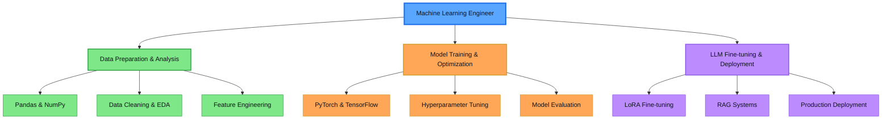

<div align="center">

# 👨‍💻 Hi there, I'm Onur TİLKİ

[](https://git.io/typing-svg)

[](https://www.linkedin.com/in/onurtilki/)
[](https://github.com/4F71)
[](https://www.kaggle.com/onurtilki)
[](mailto:mehmetonurt@gmail.com)


</div>

---

## 🚀 About Me

```python
class MachineLearningEngineer:
    def __init__(self):
        self.name = "Mehmet Onur TİLKİ"
        self.role = "Machine Learning Engineer"
        self.location = "Ankara, Turkey 🇹🇷"
        self.motto = "Specializing in data preparation, model training, and LLM fine-tuning"
        
        self.expertise = {
            "languages": ["Python", "SQL"],
            "ml_frameworks": ["PyTorch", "TensorFlow", "Scikit-learn"],
            "generative_ai": ["LoRA Fine-tuning", "RAG Systems", "Prompt Engineering"],
            "llm_tools": ["LangChain", "Hugging Face", "Gemini API"],
            "data_science": ["Pandas", "NumPy", "SciPy"],
            "vector_db": ["ChromaDB", "Sentence Transformers (384-dim)"],
            "deployment": ["FastAPI", "Streamlit", "Docker"],
            "optimization": ["4-bit Quantization", "GPU Optimization", "API Rate Limiting"]
        }
        
        self.current_projects = [
            "🎯 ExMate - Turkish Relationship Dialogue Analysis (LoRA on Mistral 7B)",
            "💬 MentorMate - Production RAG System (3,232 Q&A, <3s response)",
            "🎵 PromptWave - Prompt-Driven Audio Generation"
        ]
        
        self.learning = [
            "Advanced LLM Fine-tuning Techniques",
            "Production-ready ML Systems",
            "MLOps & Model Deployment"
        ]
    
    def say_hi(self):
        print("Thanks for visiting! Let's build intelligent systems together 🚀")

me = MachineLearningEngineer()
me.say_hi()
```

<div align="center">

**🔭 Currently:** Building production-ready AI/ML solutions  
**🌱 Learning:** Advanced LLM optimization & MLOps  
**💡 Passionate about:** Generative AI, RAG architectures, and model fine-tuning  
**📍 Based in:** Ankara, Turkey

</div>

---

## 🛠️ Tech Stack

<div align="center">

### 💻 Core Technologies


### 🤖 Machine Learning & Deep Learning


### ✨ Generative AI & LLM Stack


### 🗄️ Databases


### 📊 Visualization


### 🚀 Deployment & Tools


### ⚡ Optimization


</div>

---

## 📊 GitHub Statistics

<div align="center">

<table>
<tr>
<td width="50%" align="center">


</td>
<td width="50%" align="center">


</td>
</tr>
</table>

</div>

---

## 💻 Language Usage

<div align="center">


</div>

---

## 🏆 GitHub Achievements

<div align="center">


</div>

---

## 💡 My Expertise Areas

<div align="center">



</div>

---

## 📈 Contribution Activity

<div align="center">


</div>

---

## 🎓 Certifications

<div align="center">

| 🏆 Certification | 🎯 Key Skills | 📅 Year |
|:---|:---|:---:|
| **Akbank Generative AI Bootcamp** | RAG Systems, LangChain, Prompt Engineering | 2025 |
| **Google AI Essentials** | Generative AI Fundamentals, Responsible AI | 2025 |
| **Deep Learning with Keras (BTK)** | TensorFlow, CNN, Model Optimization | 2025 |

</div>

---

## 🚀 Notable Projects

<div align="center">

### 🎯 ExMate - Turkish Relationship Dialogue Analysis LLM
**LoRA fine-tuning on Mistral 7B Instruct for Turkish WhatsApp dialogues**

`PyTorch` • `LoRA (r=16, α=16)` • `Gemini 2.0 Flash` • `4-bit Quantization` • `GPU Optimized`

- Fine-tuned Mistral 7B with LoRA for Turkish dialogue understanding
- Synthetic data generation using Gemini 2.0 Flash API
- Optimized training with 4-bit quantization for efficient GPU usage

[](https://github.com/4F71/ExMate)

---

### 💬 MentorMate - RAG-Based FAQ Chatbot
**Production-ready RAG system with semantic search**

`LangChain` • `ChromaDB` • `Sentence Transformers` • `MultiQueryRetriever` • `Streamlit`

- 3,232 Q&A pairs with <3 second response time
- Semantic search using MultiQueryRetriever + MMR
- 40+ keyword mapping for Turkish language support
- Hallucination prevention with 384-dimensional embeddings

[](https://github.com/4F71/MentorMate-SSS)

---

### 🎵 PromptWave - Prompt-Driven Audio Generation
**Text-based audio synthesis with DSP pipeline**

`Python` • `NumPy` • `SciPy` • `Prompt Engineering` • `DSP`

- Text-to-audio generation system using prompt engineering
- Custom DSP pipeline for audio processing
- Real-time audio synthesis capabilities

[](https://github.com/4F71/PromptWave)

---

[](https://github.com/4F71?tab=repositories)

</div>

---

## 🤝 Let's Connect!

<div align="center">

### 💼 Open to opportunities in:

**Machine Learning Engineering** • **AI/ML Research** • **LLM Fine-tuning**  
**RAG Systems** • **Generative AI** • **Production ML Deployment**

---

[](https://www.linkedin.com/in/onurtilki/)
[](mailto:mehmetonurt@gmail.com)
[](https://www.kaggle.com/onurtilki)
[](https://github.com/4F71)

### 📧 Best way to reach me: **mehmetonurt@gmail.com**

---


**⭐ If you find my projects interesting, feel free to star them!**


</div>
