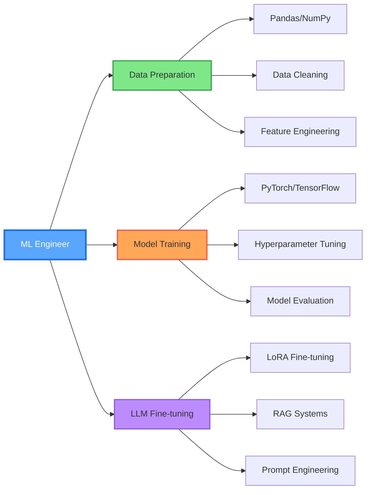

<div align="center">

# 👨‍💻 Hi there, I'm Onur TİLKİ

[](https://git.io/typing-svg)

[](https://www.linkedin.com/in/onurtilki/)
[](https://github.com/4F71)
[](https://www.kaggle.com/onurtilki)
[](mailto:mehmetonurt@gmail.com)


</div>

---

## 🚀 About Me

```python
class MachineLearningEngineer:
    def __init__(self):
        self.name = "Mehmet Onur TİLKİ"
        self.role = "Machine Learning Engineer"
        self.location = "Ankara, Turkey 🇹🇷"
        
        self.expertise = {
            "languages": ["Python", "SQL"],
            "ml_frameworks": ["PyTorch", "TensorFlow", "Scikit-learn"],
            "generative_ai": ["LoRA Fine-tuning", "RAG", "LangChain", "Prompt Engineering"],
            "data_tools": ["Pandas", "NumPy", "SciPy"],
            "vector_db": ["ChromaDB", "Sentence Transformers"],
            "deployment": ["FastAPI", "Streamlit", "Docker"],
            "apis": ["Gemini API", "Hugging Face"],
            "optimization": ["4-bit quantization", "GPU optimization", "API rate limiting"]
        }
        
        self.current_projects = [
            "🎯 ExMate - Turkish Relationship Dialogue Analysis LLM",
            "💬 MentorMate - RAG-Based FAQ Chatbot",
            "🎵 PromptWave - Prompt-Driven Audio Generation"
        ]
        
        self.certifications = [
            "Akbank Generative AI Bootcamp (2025)",
            "Google AI Essentials (2025)",
            "Deep Learning with Keras (BTK, 2025)"
        ]
        
        self.motto = "Specializing in data preparation, model training, and LLM fine-tuning"
    
    def say_hi(self):
        print("Thanks for visiting! Let's build intelligent systems together 🚀")

me = MachineLearningEngineer()
me.say_hi()
```

<div align="center">

### 🎯 Quick Highlights

🔭 **Focus:** Data preparation, Model training, LLM fine-tuning  
🌱 **Learning:** Advanced ML optimization & Production-ready AI systems  
💡 **Passion:** Generative AI & RAG architectures  
🤝 **Open to:** Collaborations on ML/AI projects  
📍 **Location:** Ankara, Turkey

</div>

---

## 🛠️ Tech Stack & Tools

<div align="center">

### 💻 Programming & Data Science


### 🤖 Machine Learning & Deep Learning


### ✨ Generative AI & LLM


### 🗄️ Databases & Vector Stores


### 📊 Data Visualization


### 🚀 Deployment & Tools


### ⚡ Optimization & Performance


</div>

---

## 📊 GitHub Statistics

<div align="center">

<table>
<tr>
<td width="50%">


</td>
<td width="50%">


</td>
</tr>
</table>

</div>

---

## 💻 Most Used Languages

<div align="center">


</div>

---

## 🎯 What I'm Working On

<div align="center">

```python
current_focus = {
    "machine_learning": {
        "techniques": ["Supervised Learning", "Unsupervised Learning", "Transfer Learning"],
        "optimization": ["Hyperparameter Tuning", "Model Compression", "Ensemble Methods"],
        "tools": ["Scikit-learn", "XGBoost", "CatBoost"]
    },
    
    "deep_learning": {
        "architectures": ["Neural Networks", "CNNs", "RNNs", "Transformers"],
        "frameworks": ["PyTorch", "TensorFlow", "Keras"],
        "applications": ["Computer Vision", "NLP", "Time Series"]
    },
    
    "generative_ai": {
        "llm_work": ["LoRA Fine-tuning", "Prompt Engineering", "Model Evaluation"],
        "rag_systems": ["LangChain", "ChromaDB", "Semantic Search"],
        "optimization": ["4-bit Quantization", "GPU Acceleration", "Inference Speed"]
    },
    
    "mlops": {
        "deployment": ["FastAPI", "Streamlit", "Docker"],
        "monitoring": ["API Rate Limiting", "Error Handling", "Performance Metrics"],
        "version_control": ["Git", "GitHub", "Model Versioning"]
    }
}
```

</div>

---

## 🏆 GitHub Achievements

<div align="center">


</div>

---

## 🌟 Featured Projects

<div align="center">

### 🎯 ExMate - Turkish Relationship Dialogue Analysis LLM
**LoRA fine-tuning on Mistral 7B Instruct for Turkish WhatsApp dialogues**  
`PyTorch` • `LoRA (r=16, alpha=16)` • `Gemini 2.0 Flash` • `4-bit Quantization`

[](https://github.com/4F71/ExMate)

---

### 💬 MentorMate - RAG-Based FAQ Chatbot
**Production-ready RAG system with 3,232 Q&A pairs, <3s response time**  
`LangChain` • `ChromaDB` • `MultiQueryRetriever` • `Sentence Transformers (384-dim)`

[](https://github.com/4F71/MentorMate-SSS)

---

### 🎵 PromptWave - Prompt-Driven Audio Generation
**Text-based audio generation system with DSP pipeline**  
`Python` • `NumPy` • `SciPy` • `Prompt Engineering`

[](https://github.com/4F71/PromptWave)

---

[](https://github.com/4F71?tab=repositories)

</div>

---

## 📈 Contribution Activity

<div align="center">


</div>

---

## 🎓 Certifications & Learning

<div align="center">

| 🏆 Certification | 🎯 Focus Areas | 📅 Year |
|:---|:---|:---:|
| **Akbank Generative AI Bootcamp** | RAG, LangChain, Prompt Engineering | 2025 |
| **Google AI Essentials** | Generative AI Fundamentals, Responsible AI | 2025 |
| **Deep Learning with Keras** | TensorFlow, CNN, Model Optimization | 2025 |

</div>

---

## 💡 Interactive Skills Matrix

<div align="center">



</div>

---

## 🤝 Let's Connect & Collaborate!

<div align="center">

### 💼 Open to opportunities in:

🎯 **Machine Learning Engineering** • 🧠 **AI/ML Research** • 🚀 **Generative AI Projects**  
💬 **RAG Systems** • 🔧 **LLM Fine-tuning** • 📊 **Data Science**

---

[](https://www.linkedin.com/in/onurtilki/)
[](mailto:mehmetonurt@gmail.com)
[](https://www.kaggle.com/onurtilki)
[](https://github.com/4F71)

### 📧 Best way to reach me: [mehmetonurt@gmail.com](mailto:mehmetonurt@gmail.com)

---


**⭐ If you find my work interesting, don't forget to star the repositories!**


</div>
