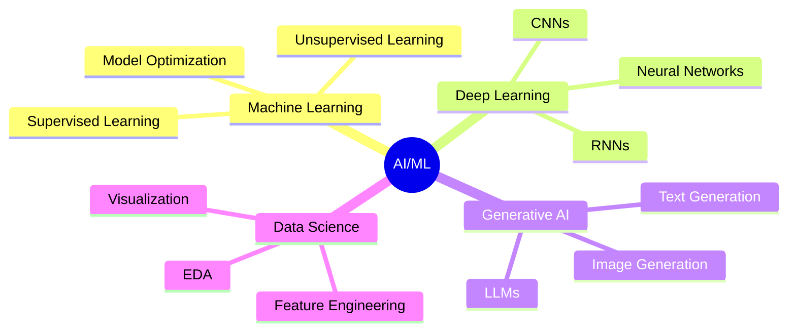

<div align="center">

# 👨‍💻 Hi there, I'm Onur TİLKİ

[](https://git.io/typing-svg)

[](https://www.linkedin.com/in/onurtilki/)
[](https://github.com/4F71)
[](https://github.com/4F71)

</div>

---

## 🚀 About Me

```python
class AIMLDeveloper:
    def __init__(self):
        self.name = "Onur TİLKİ"
        self.role = "AI & Machine Learning Developer"
        self.languages = ["Python", "SQL"]
        self.current_focus = [
            "Building ML models",
            "Generative AI applications",
            "End-to-end ML pipelines"
        ]
        self.motto = "Learn by building, grow by sharing"
    
    def say_hi(self):
        print("Thanks for dropping by! Let's build something amazing together 🚀")

me = AIMLDeveloper()
me.say_hi()
```

<div align="center">

### 🎯 Quick Facts

🔭 Currently building **AI/ML projects** to solve real-world problems  
🌱 Learning **advanced ML algorithms** and **MLOps**  
💡 Passionate about **Generative AI** and **intelligent systems**  
🤝 Open to **collaborations** on AI/ML projects  
📫 Reach me: [LinkedIn](https://www.linkedin.com/in/onurtilki/)

</div>

---

## 🛠️ Tech Stack

<div align="center">

### Languages & Frameworks


### AI & Machine Learning


### Data Science & Visualization


### Databases


### Tools & Platforms


</div>

---

## 📊 GitHub Stats

<div align="center">


</div>

---

## 💻 Most Used Languages

<div align="center">


</div>

---

## 🏆 GitHub Trophies

<div align="center">


</div>

---

## 🎯 What I'm Working On

<div align="center">



</div>

---

## 🌟 Featured Projects

<div align="center">

### 🚧 Building awesome projects - Coming Soon! 🚧

[](https://github.com/4F71)

_Stay tuned for exciting AI/ML projects!_

</div>

---

## 📈 Contribution Graph

<div align="center">


</div>

---

## 💡 Random Dev Quote

<div align="center">


</div>

---

## 🤝 Let's Connect!

<div align="center">

### I'm always excited to collaborate on AI/ML projects! 🚀

[](https://www.linkedin.com/in/onurtilki/)
[](mailto:YOUR_EMAIL@gmail.com)
[](https://github.com/4F71)

### 📬 Feel free to reach out for:
💼 Job Opportunities | 🤝 Collaborations | 💡 AI/ML Discussions | 🎓 Learning Together

---


**⭐ If you find my work interesting, don't forget to star the repositories!**


</div>
